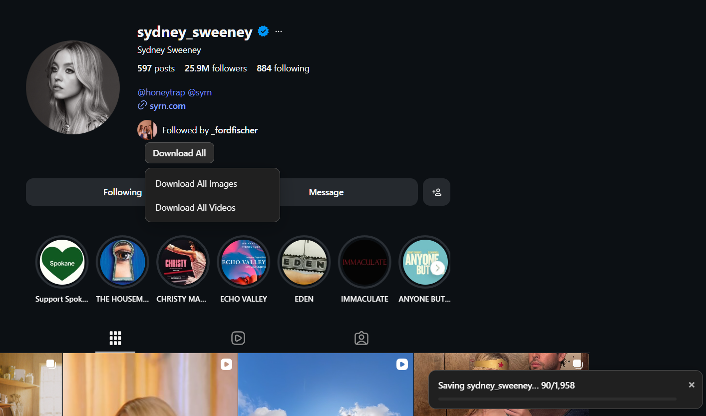
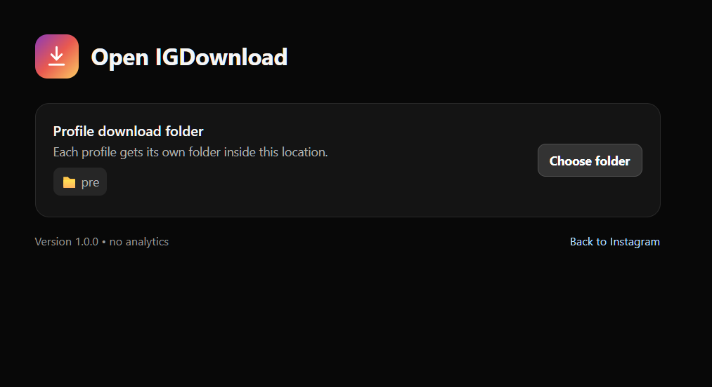

# Open IGDownload

Open IGDownload adds simple download controls to Instagram in your browser. Save individual photos, videos, Reels, Stories, carousels, or export the images or videos from a profile.

Unlike many similar download extensions and services, Open IGDownload has **no tracking analytics or crash-reporting telemetry**. It does not collect or send usage data.



## What it can download

- A photo, video, Reel, or every item in a carousel
- Posts from profile, Explore, Saved, Tagged, and Reel grids
- The current Story or every available Story for an account
- All images or all videos from a profile
- A profile picture

Open IGDownload shows discovery, queue, and export progress directly on the Instagram page. During profile exports, files that already exist are skipped so an interrupted export can be restarted.

## Install

Open IGDownload is installed manually as an unpacked extension. It works with Chrome, Edge, and other Chromium-based browsers that support Manifest V3.

1. Download this repository:
   - On GitHub, select **Code** → **Download ZIP**, or download a packaged release ZIP if one is available.
2. Extract the ZIP to a permanent folder. Do not delete this folder while the extension is installed.
3. Open your browser's extensions page:
   - Chrome: `chrome://extensions`
   - Edge: `edge://extensions`
   - Brave: `brave://extensions`
4. Turn on **Developer mode**.
5. Select **Load unpacked**.
6. Choose the extracted folder that contains `manifest.json`.
7. Sign in to [Instagram](https://www.instagram.com/) and refresh any Instagram tabs that were already open.

You can optionally pin Open IGDownload from the browser's Extensions menu for quick access to its settings.

## Use

### Download a post, Reel, or Story

- On a post, use the download control beside Instagram's **More options** button. A carousel is downloaded in full.
- On profile, Explore, Saved, Tagged, and Reel grids, hover over a tile and select its download control.
- In the Story viewer, use the controls near the top-right to download the current Story or all available Stories.
- Use `Ctrl+Shift+D` on Windows/Linux or `Cmd+Shift+D` on macOS to download the current post or Story.

Individual files are saved through your browser's normal download manager and follow its configured download location and prompt settings.

### Export a profile

1. Open the Instagram profile.
2. Select **Download All** below the profile information.
3. Choose **Download All Images** or **Download All Videos**.
4. On the first export, choose a root download folder when prompted.

Open IGDownload creates a separate folder for each profile inside the selected location. Large exports may take some time, and Instagram may temporarily rate-limit requests. If an item cannot be written, the extension saves a small `.error.txt` file beside it with the error details.

### Choose the profile download folder

Select Open IGDownload in the browser toolbar to open the settings page, then select **Choose folder**. The settings page opens on `instagram.com` so the browser can safely remember the folder permission needed for profile exports.



## Privacy and permissions

Open IGDownload does not include tracking analytics, advertising trackers, or third-party error-reporting services. Media lookup requests go only to Instagram, and downloads go only to Instagram/Facebook CDN hosts.

The extension requests only the browser permissions needed to work:

- **Downloads** saves individual media through the browser's download manager.
- **Storage** remembers local extension settings.
- **Instagram and CDN access** finds media on Instagram pages and downloads the selected files.

Selected profile-folder access is handled by the browser's File System Access API. Open IGDownload cannot access folders you have not chosen.

## Troubleshooting

- **Download controls are missing:** Refresh the Instagram tab after installing or reloading the extension.
- **Profile export asks for a folder again:** Open the extension settings and choose the folder again; browsers may revoke saved folder access.
- **An export slows down or stops:** Instagram may be rate-limiting a large export. Wait before trying again. Existing files will be skipped.
- **The extension no longer works after an Instagram update:** Instagram changes its private page structure and response formats frequently. Check this repository for an updated version.

## Update or remove

To update, replace the extracted extension files with the newer version, return to the browser's extensions page, and select **Reload** on Open IGDownload.

To remove it, select **Remove** on the same extensions page. Downloaded media is not deleted when the extension is removed.

## Responsible use

Only download media you own or are allowed to access and save. Open IGDownload is not affiliated with or endorsed by Instagram or Meta.

## For contributors

There is no build step or runtime dependency. All extension source is in `src/`.

```sh
npm test
npm run check
```

Instagram changes its private DOM and response formats frequently. The implementation uses semantic selectors and multiple response fallbacks, but a future Instagram update may require selector or adapter updates.
